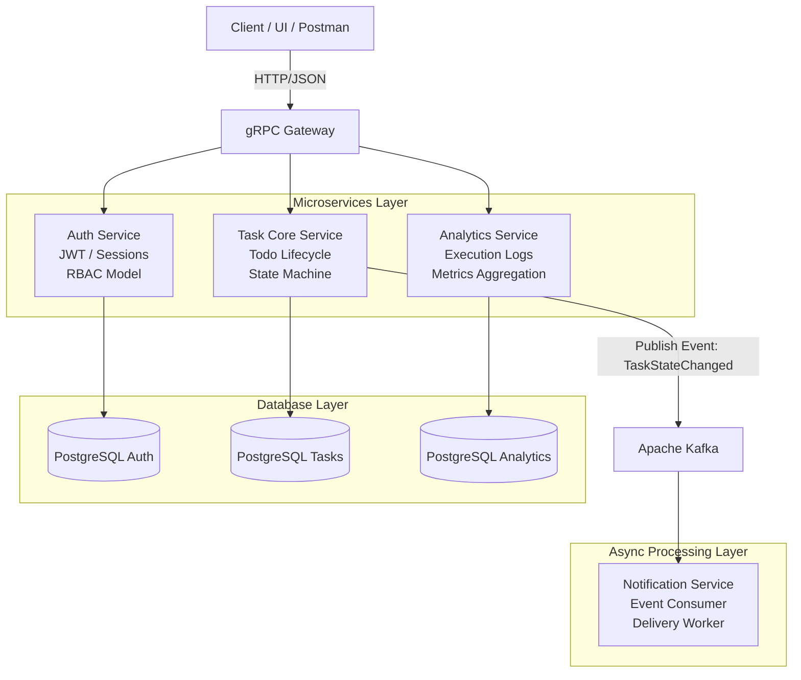

# Actium Engine: Distributed Task Tracking & Workflow Automation Core

A high-performance, fault-tolerant task tracking application backend designed to scale from a single modular monolith into an Event-Driven Microservices Architecture (EDA). Built with Go, this project serves as a showcase of enterprise engineering practices, implementing Domain-Driven Design (DDD) boundaries and Clean Architecture principles.

## 🏗 System Architecture Diagram



## 🛠 Tech Stack

- Backend Core: Go (1.22+), Clean Architecture (Domain, Usecase, Repository, Delivery)
- API Protocols: gRPC (Protobuf v3) + gRPC-Gateway (REST over HTTP/JSON)
- Database: PostgreSQL (isolated per domain), migrations via golang-migrate, queries via sqlc
- Event Streaming: Apache Kafka / RabbitMQ for asynchronous orchestration
- Observability: Structured logging via slog, graceful shutdown handling, Docker-based deployment

## 📦 System Evolution Roadmap

### Phase 1: Modular Monolith Baseline

- Core aggregates: Task, User, Project
- Clean Architecture boundaries
- PostgreSQL integration with connection pooling
- Unit tests with mocks

### Phase 2: gRPC Layer + Gateway

- Protobuf service definitions
- gRPC-Gateway HTTP → gRPC translation
- HTTP/2 transport optimization

### Phase 3: Auth Microservice Extraction

- Separate authentication service
- JWT claims-based authorization
- gRPC interceptors for security context propagation

### Phase 4: Event-Driven Architecture

- Kafka/RabbitMQ integration
- Domain events: TaskCreated, TaskCompleted
- Worker-based async consumers with idempotent processing

## 🚀 Quick Start

### Prerequisites

- Docker
- Docker Compose

### Run System

```bash
docker compose up --build -d
```

The system initialization automation takes care of missing schema configurations and maps the following execution targets:

- :8080 — Primary Public HTTP JSON REST Gateway Proxy Entry point

- :50051 — Internal Native Binary transport gRPC Service Core Interface

## 🔧 Protobuf Compilation Target

Run the compiled artifact target generation process whenever changes are introduced into service layer definitions under the /proto directory tree:

```bash
protoc --go_out=. --go_opt=paths=source_relative \
    --go-grpc_out=. --go-grpc_opt=paths=source_relative \
    --grpc-gateway_out=. --grpc-gateway_opt=paths=source_relative \
    proto/*.proto
```

## 💎 Production Architecture Benchmarks

- Zero Database Sharing Pattern: Services completely manage their dedicated standalone persistence layers. Communication across separate system entities exclusively operates via explicit asynchronous streaming topics or direct network remote calls.

- Signal Handled Graceful Shutdown: Entry components listen to standard incoming operational kill signals (SIGINT, SIGTERM), forcing background listener closures, blocking inbound queues, flushing database connections safely, and processing ongoing stream segments cleanly to prevent active runtime crashes.

- Enterprise-ready Logging Layouts: Emits optimized contextual JSON arrays using standard library slog abstractions, preconfigured for smooth integration out of the box with standard observability collection agents like FluentBit or Vector.
